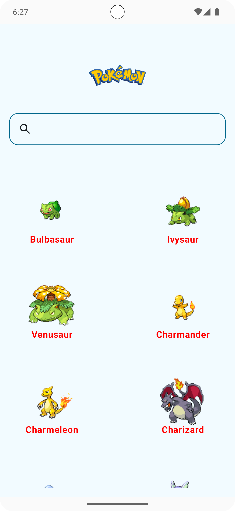
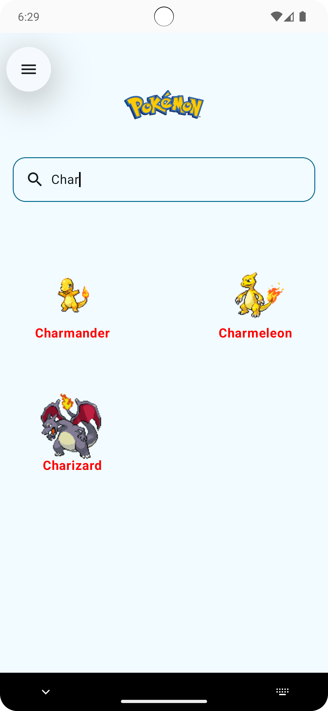
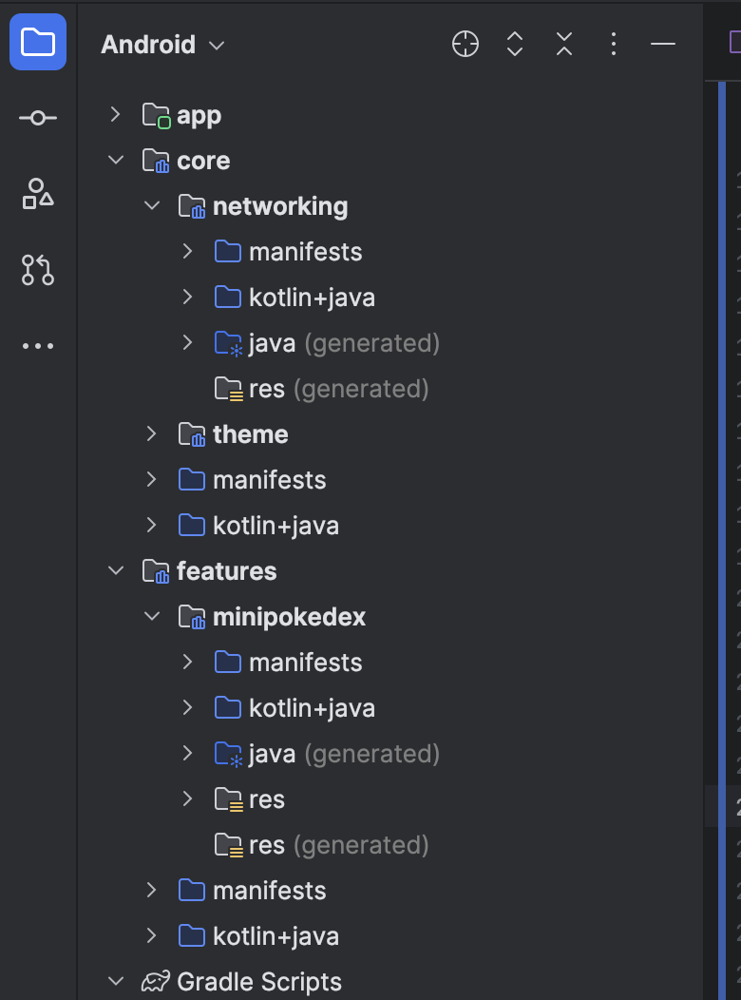

## PokeX

PokeX shows a list of Pokémon species and delves more into their powers.
## Requirements:

### Home Screen
- Shows the list of the first 100 Pokémon ( picture and name)
- There is a search functionality that when pressed shows the Pokémon you want to want to view.

### Info screen

Displays Pokémon selected

- Pokémon Name
- A picture of the selected Pokémon and relevant information related to it.
    
## App (PokeX) Screenshots

## Setup

To setup and run the project, run it
on [Android Studio Ladybug](https://developer.android.com/studio) or a newer Version

## Architecture

The PokeX uses modularization and MVVM architecture
[Guide to app architecture](https://developer.android.com/topic/architecture)

Below shows the modularization diagram that is followed on PokeX

### App Module

The app module, depends on two modules `:features:minipokedex` and `:core:theme`.The code module 
contains the theming while feature are in feature module

### Feature Module

The feature modules, one feature of the app - minipokedex (list of Pokémon and the details).This can be tested in isolation.

### Core Module

The core modules has a theme and networking module that can be used by the rest of the modules( and any other ).
These two modules are common and reusable across the app - for a bigger app we can also introduce a 
common module to host all common features.

## Libraries and tools

Some of the libraries and tools used in the project include

- [Kotlin](https://developer.android.com/kotlin?gclid=Cj0KCQjwoK2mBhDzARIsADGbjeoMVO2Ww0zuUmtQGg8DUqVSPDWhBPGC8vGmtx1GOrh6ZpfoOFIEbKcaAoH1EALw_wcB&gclsrc=aw.ds)
  as the main language (and for testing)
- [JetPack Compose](https://developer.android.com/jetpack/compose?gclid=Cj0KCQjwoK2mBhDzARIsADGbjepwqpW6sXqc0B5GpGglo6zv7XivC252sRc1vbv5HR9Ao--GzmRNKf4aAqPFEALw_wcB&gclsrc=aw.ds)
  for UI and navigation
- [Accompanist](https://github.com/google/accompanist) : A collection of extension libraries for
  Jetpack Compose
- [Material Icons](https://developer.android.com/jetpack/compose/graphics/images/material)
- [Coil](https://coil-kt.github.io/coil/compose/) - For image loading
- [Hilt](https://developer.android.com/training/dependency-injection/hilt-android) for dependency
  injection
- [Junit](https://developer.android.com/training/testing/local-tests) - For unit testing
- [Kotlin Coroutines](https://kotlinlang.org/docs/coroutines-overview.html) for asynchronous calls to the pokemon api
- [Retrofit](https://square.github.io/retrofit/) for REST networking
- [Eithernet](https://github.com/slackhq/EitherNet) A pluggable sealed API result type for modeling
  Retrofit responses.
- [Moshi](https://github.com/square/moshi) for JSON serialization and conversion
- [Okhttp](https://square.github.io/okhttp/) for network and logging
